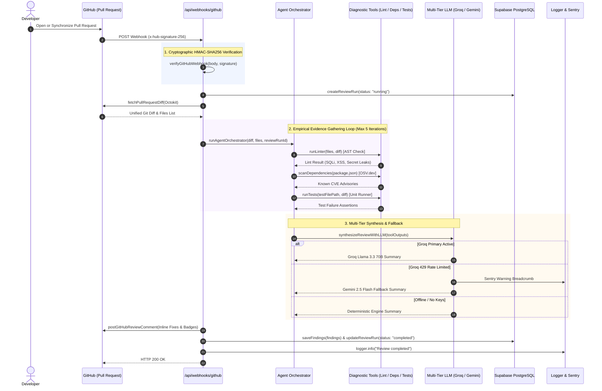
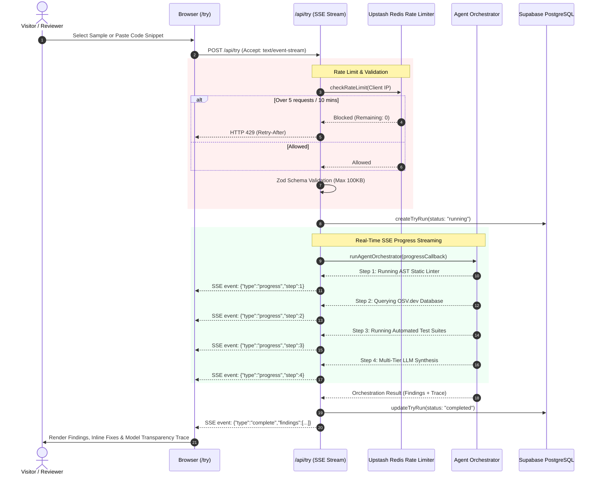

# 📐 DevGuard AI System Architecture

DevGuard AI is designed around an **empirical tool-calling agent loop**. Rather than relying on LLM text completions over raw pull request diffs, DevGuard AI operates as an intelligent orchestrator that gathers verified evidence through AST linters, CVE databases, and test runners before synthesizing structured review findings.

---

## 🔄 End-to-End Request Flows

### 1. GitHub Webhook Autonomous Review Flow

---

### 2. Interactive Playground Flow (`/try`)

---

## 🛡️ Core Architectural Invariants

1. **Empirical Verification First**:
   - Zero LLM hallucination on raw code. Every finding is anchored to an empirical tool execution (`runLinter`, `scanDependencies`, `runTests`).
2. **Hard Iteration Limit**:
   - `MAX_ITERATIONS = 5` strictly bounds loop cycles, preventing runaway compute or recursion.
3. **Multi-Tier Model Resilience**:
   - Primary: **Groq Llama 3.3 70B** (high throughput)
   - Fallback: **Google Gemini 2.5 Flash** (rate-limit resilience)
   - Offline: **Deterministic Rule Engine** (zero external downtime)
4. **Zero Code Execution on Pasted Snippets**:
   - All diagnostic tools operate via in-memory abstract syntax tree analysis and regex scanners. User-provided code is never evaluated with `eval()` or executed in system shells.
5. **Defense-in-Depth Security**:
   - Webhooks validated via HMAC-SHA256.
   - External inputs sanitized and type-checked via Zod schemas.
   - Public endpoints rate-limited via Upstash Redis sliding window.
