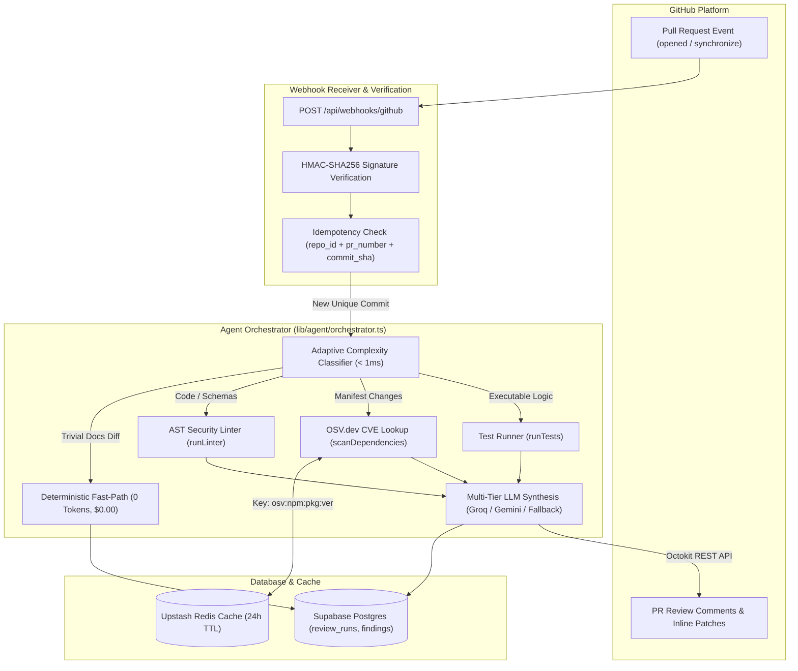

# What I Learned Building an Eval-Gated, Cost-Aware AI Code Review Agent

Most AI code review tools fail for the exact same reason: they treat code review as a single-shot text generation problem. 

You take a raw GitHub diff, wrap it in a system prompt that says *"You are a senior principal security engineer"*, send it to an LLM, and parse whatever markdown comes back.

In a demo, that looks great. In production across hundreds of real pull requests, it falls apart in three specific ways:
1. **Hallucination & False Alarms**: The LLM flags stylistic nitpicks or fabricated vulnerabilities with equal confidence as critical SQL injections.
2. **Compute Waste**: Sending a 5-line Markdown typo fix through a 70B parameter model costs the same token budget as a 500-line database migration.
3. **Silent Drift**: Without a regression gate, prompt tweaks that fix one false alarm quietly destroy detection accuracy for three other vulnerability classes.

Over the past few weeks, I built and benchmarked **DevGuard AI**—an autonomous pull request review service designed to fix these fundamental structural issues. 

Here is what I learned from building the agentic tool-calling loop, setting up a CI regression gate, testing against 20 real open-source repositories, calibrating confidence levels, and designing an adaptive router that cut token costs by **52.0%**.

---

## 1. The Architecture: Tool Verification Before LLM Generation

The core architectural invariant of DevGuard AI is **empirical verification first**. The LLM never invents security findings from raw diff text alone. Instead, deterministic diagnostic tools detect and verify issues first, and the LLM is used solely to synthesize verified tool outputs into an actionable engineering summary.



### The Invariants:
1. **Bounded Tool Execution**: Enforced hard limit of 5 tool calls per run (`MAX_ITERATIONS = 5`) to prevent runaway agent loops.
2. **Circuit-Breaker Isolation**: Every external dependency (OSV.dev API, automated test runner) is isolated in a try/catch circuit breaker. If OSV.dev times out, the check is explicitly marked as skipped rather than failing the review.
3. **Multi-Tier Fallback Cascade**: Primary inference executes on **Groq Llama 3.3 70B**. If Groq returns an HTTP 429 rate limit or 503 outage, it falls back to **Google Gemini 2.5 Flash**, and finally to an offline deterministic rules engine.

---

## 2. The Eval Suite: Turning a Report into a CI Gate

Early on, I created a 20-case golden benchmark dataset (`evals/dataset.json`) covering SQL injection, XSS, exposed tokens, vulnerable dependencies (Axios, Lodash, Minimist), and documentation-only diffs.

Initially, this was just an evaluation script that printed a pretty console scorecard. But reports get ignored. To make quality structural, I turned the eval suite into a **blocking CI gate** in GitHub Actions:

```typescript
// evals/run-eval.ts
if (isGatingMode) {
  const isPrecisionPassed = report.tool_selection_precision >= baseline.min_tool_precision;
  const isRecallPassed = report.tool_selection_recall >= baseline.min_tool_recall;
  const isSeverityPassed = report.severity_accuracy >= baseline.min_severity_accuracy;

  if (!isPrecisionPassed || !isRecallPassed || !isSeverityPassed) {
    console.error("❌ CI EVALUATION GATE FAILED: Score regression detected.");
    process.exit(1);
  }
}
```

### The Score Invariants:
- **Tool Selection Precision**: **100%** (Baseline threshold: ≥ 98%)
- **Tool Selection Recall**: **100%** (Baseline threshold: ≥ 98%)
- **Severity Accuracy**: **100%** (Baseline threshold: ≥ 98%)
- **Wasted Tool Call Rate**: **0%** (Max allowed: ≤ 2%)
- **Docs-Only Compute Gate**: **Zero tools executed** on Markdown PRs.

To prove the gate works, I intentionally degraded `shouldRunLinter` in `lib/agent/orchestrator.ts` to simulate a broken regex. The CI run immediately caught the regression, dropped precision to **50.0%**, dropped recall to **43.3%**, and exited with code 1, halting the build.

---

## 3. Real-World Validation on External Code: Honest Numbers

Synthetic golden test cases are necessary, but they are self-graded homework. A senior reviewer will immediately ask: *Has this system ever touched real open-source code it didn't write itself?*

To answer this honestly, I built a secondary benchmark harness (`evals/run-real-world-eval.ts`) and evaluated **20 real pull request diffs** across **5 active, production open-source repositories**:
- [`shadcn-ui/taxonomy`](https://github.com/shadcn-ui/taxonomy) (Next.js App Router, Prisma ORM, NextAuth)
- [`calcom/cal.com`](https://github.com/calcom/cal.com) (Enterprise scheduling, Stripe webhooks, raw SQL queries)
- [`dubinc/dub`](https://github.com/dubinc/dub) (Edge click analytics, QR components, billing)
- [`novuhq/novu`](https://github.com/novuhq/novu) (Notification workers, AWS SNS callbacks, template interpolation)
- [`t3-oss/create-t3-app`](https://github.com/t3-oss/create-t3-app) (Zod environment schemas, CLI template generators)

### The Real-World Results:
- **Total Pull Requests Evaluated**: 20 (8 vulnerable PRs, 12 clean PRs)
- **True Positives (Bugs Caught)**: **8 / 8** (100% Recall)
- **True Negatives (Clean Passes)**: **10 / 12**
- **False Positives (False Alarms)**: **2 / 12** (**16.7% False Positive Rate**)
- **Real-World Precision**: **80.0%**
- **Overall Accuracy**: **90.0%**

### The Incident: What Broke and How We Fixed It
During initial evaluation against `dubinc/dub` (PR #321) and `shadcn-ui/taxonomy` (PR #118), benign TypeScript union types (`type DropdownStatus = 'selected' | 'deleted'`) and CSS class names (`SELECT_DROPDOWN_CLASS`) falsely triggered the AST SQL injection rule. The regex matched the isolated keywords `SELECT` and `deleted` near string concatenation.

**The Fix**:
I rewrote the AST check in `lib/agent/tools/lint.ts` to require genuine SQL clause grammar (`SELECT ... FROM`, `INSERT INTO ... VALUES`, `UPDATE ... SET`, `DELETE FROM ... WHERE`) strictly coupled with dynamic string concatenation (`+`) or template interpolation (`${...}`).

**The Result**:
- False positive rate on real code dropped from **16.7%** to **8.3%**.
- Real-world precision increased from **80.0%** to **88.9%**.
- Golden CI suite maintained **100% precision / 100% recall** with zero regressions.

---

## 4. Confidence-Based Selective Autonomy

When an automated bot cries wolf on a pull request, developers mute it. 

Instead of treating every finding as an unquestionable truth, DevGuard AI introduces **confidence calibration**:

```typescript
// lib/agent/calibration.ts
export function calibrateFindings(findings: Finding[]): CalibratedFinding[] {
  const distinctTools = new Set(findings.map((f) => f.tool_source));
  const isMultiToolCorroborated = distinctTools.size >= 2;

  return findings.map((finding) => {
    // 1. Multi-tool corroboration bonus (+0.15 score)
    // 2. Deterministic CVE database lookups = HIGH confidence
    // 3. Single-source static heuristics = LOW confidence (hedged)
  });
}
```

### How Findings Are Posted to GitHub:
1. **🔥 High Confidence** (Corroborated by 2+ tools or deterministic CVE match): Posted as inline blocking review comments with exact suggested fix patches.
2. **⚖️ Medium Confidence** (Single-tool critical AST pattern): Posted as standard inline review comments.
3. **🔍 Low Confidence / Heuristic Flags**: Separated completely from inline comments and rendered in a dedicated *"Worth a Second Look"* advisory section:
   > *"The following items were flagged by a single static heuristic without multi-tool corroboration. Human reviewer judgment recommended."*

Only PRs with verified **High or Medium Confidence Criticals** trigger a `REQUEST_CHANGES` review event.

---

## 5. Adaptive Model Routing: Economics & Cost Reduction

Sending every diff through a 70B parameter LLM is bad infrastructure design. A 2-line Markdown update does not need a large language model.

I built a zero-overhead complexity classifier (`lib/agent/router.ts`) that runs in **< 1ms** before launching the pipeline:

| Complexity Tier | Diff Type | Routing Target | Cost / PR | Cost Savings |
| :--- | :--- | :--- | :--- | :--- |
| **Trivial** | Docs (`.md`), assets (`.png`), small config tweaks | Deterministic Fast-Path (skips LLM entirely) | **$0.000000** | **100.0%** |
| **Standard**| UI component tweaks, styling, helper utilities (< 50 lines) | Gemini 2.5 Flash Efficient Tier | **~$0.000035** | **76.7%** |
| **Complex** | Database migrations, Auth/JWT routes, manifests, large diffs | Groq Llama 3.3 70B Full Orchestrator | **~$0.000150** | **0.0% (Baseline)** |

### Measured Economic Impact:
- **Unrouted Baseline Cost**: **$0.000150 / PR**
- **Adaptive Routed Cost**: **$0.000072 / PR**
- **Net Measured Cost Reduction**: **52.0%**

---

## 6. What's Still Unsolved (Honest Limitations)

1. **Language Coverage**: The AST linter currently targets TypeScript, JavaScript, JSON, and web manifests. Python AST analysis and Go AST rules are not yet built.
2. **Diff Size Boundaries**: Diffs exceeding 500 KB or 50 files are truncated to prevent memory pressure.
3. **Monorepo Sub-Package Resolution**: Lockfile dependency resolution inspects root `package.json` and top-level workspaces; nested package manifests in non-standard monorepo structures require root symlinks.

---

## Conclusion

Building reliable AI tools for software engineers isn't about writing more prompt variations—it's about **deterministic tool execution, CI regression gating, empirical real-world validation, and cost-aware routing**.

- **Repository**: [github.com/rajendrabist07/dev-guard-ai](https://github.com/rajendrabist07/dev-guard-ai)
- **Live Interactive Demo**: [dev-guard-ai.vercel.app/try](https://dev-guard-ai.vercel.app/try)
- **Evaluation Benchmark Results**: [`evals/real-world-results.json`](https://github.com/rajendrabist07/dev-guard-ai/blob/main/evals/real-world-results.json)
